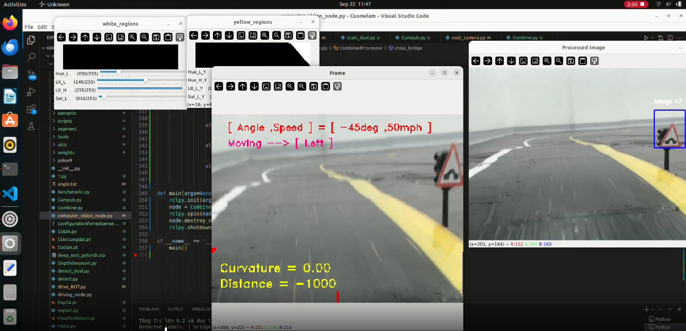
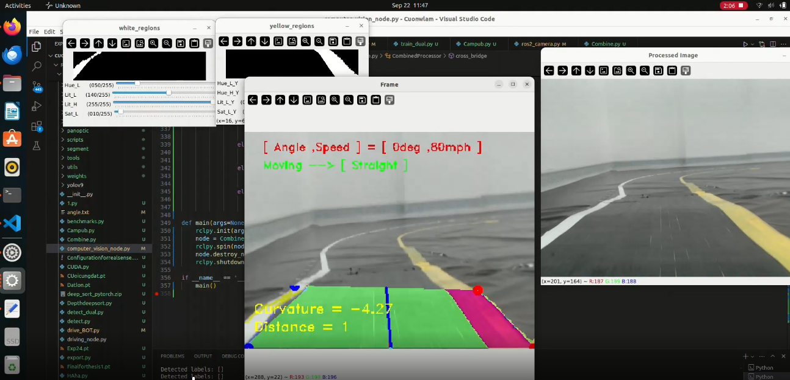
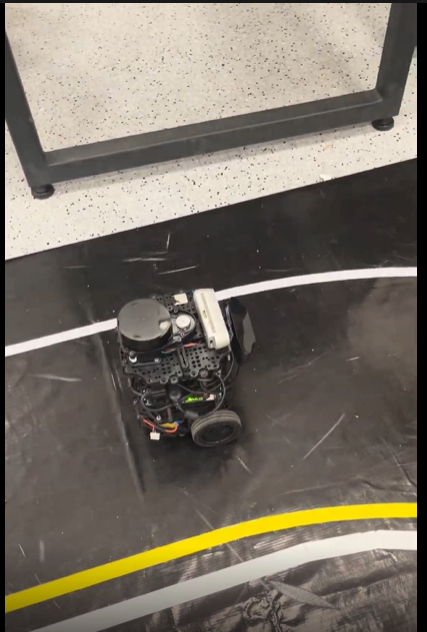
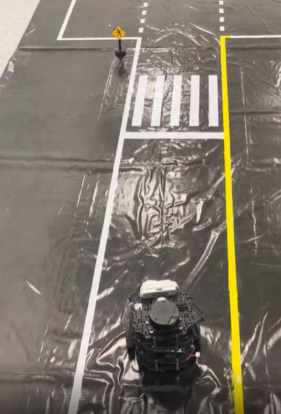
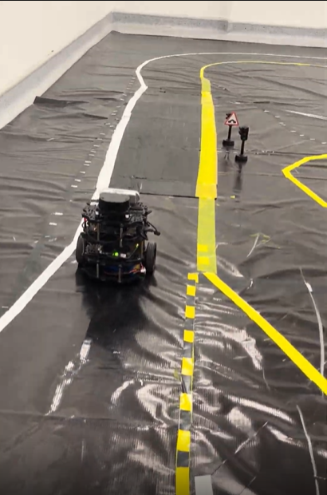

# ROS2 Autonomous Driving & Computer Vision

This project implements an autonomous driving system using ROS2 and Computer Vision. It integrates YOLOv9 for object detection and lane detection to navigate a robot autonomously in a simulated environment (AWS RoboMaker Racetrack World).

## Demo Videos

Since GitHub doesn't natively embed Google Drive videos, you can watch our simulation and detection results here:

- 🎥 **[Watch Demo Video 1 (Google Drive)](https://drive.google.com/file/d/1xmvecTzO2R3dhXF8x8HMsXHIlhGx5ORD/view?usp=sharing)**
- 🎥 **[Watch Demo Video 2 (Google Drive)](https://drive.google.com/file/d/16_48LjSHKOK3TxHFXYwJ4orAgVq-bd1T/view?usp=sharing)**

---

## Screenshots

Here are some screenshots from the simulation environment:

### Camera Views



### Spectator Views




---

## Installation & Setup

1. **Clone the repository:**
   ```bash
   git clone <your-repo-url>
   cd <your-repo-directory>
   ```

2. **Install Python dependencies:**
   The required packages are listed in `requirements.txt`. Install them using:
   ```bash
   pip install -r requirements.txt
   ```

3. **Install Git LFS for Model Weights:**
   This project uses Git LFS to manage large YOLOv9 `.pt` weight files. Ensure you have Git LFS installed:
   ```bash
   git lfs install
   git lfs pull
   ```

4. **Build the ROS2 Workspace:**
   Run the following commands at the root of your workspace:
   ```bash
   colcon build
   source install/setup.bash
   ```

## Package Structure

- **`main/ROS2-autonomous-driving-computer-vision`**: Contains the core logic for self-driving, including YOLOv9 object detection, lane tracking, and deep_sort.
- **`src/aws-robomaker-racetrack-world-ros2`**: The AWS RoboMaker simulation environment providing the 3D racetrack world.

## Note on Model Weights

The YOLOv9 weights (e.g., `Finalforthesis1.pt`) are managed via Git LFS due to their large size (~200MB). If you clone the repository without Git LFS, the `.pt` file will only contain a text pointer. Be sure to run `git lfs pull` to download the actual model weights.
